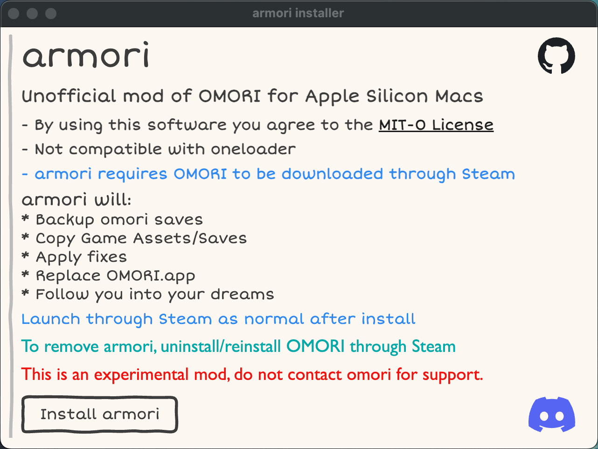

#  armori - Alpha v1.0.8
## Unofficial mod to OMORI for Apple Silicon Macs

armori modifies OMORI so it can run on M1/2 Apple Silicon macs.

This mod will likely become unnecessary in the future when the game is officially fixed.

Alpha Quality software, there are likely bugs.

## Download
Latest release here:

## Install
Double click on armori.app and read the page

## Support
Do not contact OMORI for support if you have this mod installed.

Uninstall and Reinstall OMORI through steam to remove this mod.

Post an issue here on Github if you run into issues.

[Discord Link](https://discord.gg/bJYqHRAg7A)

## Mods
Does not currently support oneloader. Oneloader does its own modifications and expects nwjs. It should be possible to polyfill this.

## License
[MIT No Attribution](LICENSE.md)

By using this software you agree to the license.

## Technical Details
- Full port of all components to apple silicon
- Ports from nwjs to Electron V22
- Greenworks upgraded and compiled to apple silicon
- Steam SDK with apple silicon used
- Various fixes/wrappers to fix deprecated functionality

Looking to eventually port to other arm platforms

