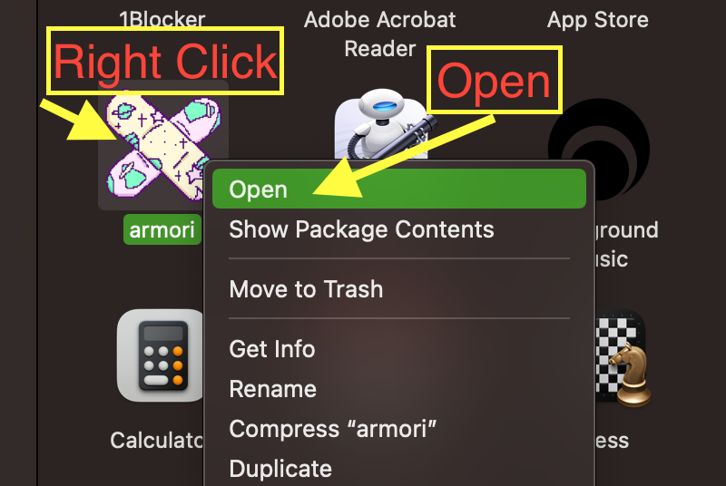

#  armori - Alpha v1.0.9
## Unofficial mod to OMORI for Apple Silicon Macs

armori modifies OMORI so it can run on M1/2 Apple Silicon macs.

This mod will likely become unnecessary in the future when the game is officially fixed.

Alpha Quality software, there are likely bugs.

## Download

By using this software you agree to the MIT-0 License

Latest release: [armori-1.0.9-arm64.dmg](https://github.com/Engelshell/armori/releases/download/v1.0.9-alpha/armori-1.0.9-arm64.dmg)

## Install
Double click does not work! You must follow this:

Right or two-finger click on armori.app, select 'open'.

## Support
Do not contact OMORI for support if you have this mod installed.

Uninstall and Reinstall OMORI through steam to remove this mod.

Post an issue here on Github if you run into issues.

[Discord Link](https://discord.gg/bJYqHRAg7A)

## Mods
Does not currently support oneloader. Oneloader does its own modifications and expects nwjs.

## License
[MIT No Attribution](LICENSE.md)

By using this software you agree to the license.

## Signing
Armori is self signed with key identity `armori - engelshell/armori`. 

## Technical Details
- Full port of all components to apple silicon
- Ports from nwjs to Electron V26
- Greenworks compiled to apple silicon
- Steam SDK with apple silicon used
- Polyfill for nw.gui to electron
- Various fixes/wrappers to fix deprecated functionality

Looking to eventually port to other arm platforms

## TODO:

- Update nw.gui wrapper to include more functionality and correctness
- Rewrite installer as standalone app
- profile and discover potential performance issues caused by synchronous IPC.

## License

MIT No Attribution

Copyright 2022 Shelby Engels

Permission is hereby granted, free of charge, to any person obtaining a copy of this software and associated documentation files (the "Software"), to deal in the Software without restriction, including without limitation the rights to use, copy, modify, merge, publish, distribute, sublicense, and/or sell copies of the Software, and to permit persons to whom the Software is furnished to do so.

THE SOFTWARE IS PROVIDED "AS IS", WITHOUT WARRANTY OF ANY KIND, EXPRESS OR IMPLIED, INCLUDING BUT NOT LIMITED TO THE WARRANTIES OF MERCHANTABILITY, FITNESS FOR A PARTICULAR PURPOSE AND NONINFRINGEMENT. IN NO EVENT SHALL THE AUTHORS OR COPYRIGHT HOLDERS BE LIABLE FOR ANY CLAIM, DAMAGES OR OTHER LIABILITY, WHETHER IN AN ACTION OF CONTRACT, TORT OR OTHERWISE, ARISING FROM, OUT OF OR IN CONNECTION WITH THE SOFTWARE OR THE USE OR OTHER DEALINGS IN THE SOFTWARE.
